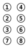
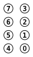
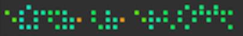
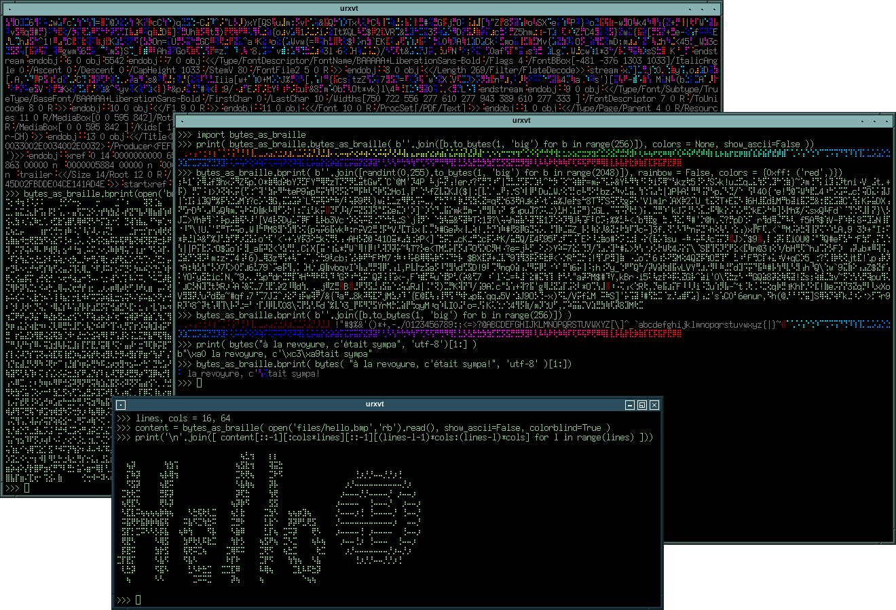

Since Python3, I have been working with bytestrings that *sometimes* decode as ASCII or UTF strings ; the environment this lives in is "mixed", as some strings are expected to decode while some are are expected to not decode.

Displaying those string as-is is not convenient, as quite a few unicode symbols will not render correctly : since I work with all sort of human languages these are frequent so I wrote a very short function that would try to decode my bytestring and return "__bytes__" if it would't decode. This, however, was not convenient because it made it impossible to distinguish undecodable bytestrings from one another, and information was lost (because I couldn't get the original bytestring again). Also, using the default Python mechanims to display those bytes was cumbersome, because each byte is displayed as 4 characters (such as \xc0), so the display quickly becomes quite messy and hard to read, even more so when ASCII-decodable characters are displayed as such.

It struck me that Braille symbols were a pretty workaround to this problem : although they are not ordered "logically" - actually they are, but based on historic grounds the first set comprises 6-dots symbols (U+2800 … U+283F), followed by the 8-dots symbols (U+2840 … T+28FF) and the order is well.. rather unconvenient to someone who is not familiar with the original 6-dot cell:



It is worth noting the following facts:

* Braille is somehow a precursor of unicode, as it uses the ⠼ symbol as a prefix to say *what follows is not a letter but a number* ; however and unlike unicode, this can prefix a *series* of symbols
* There is not *one* Braille : every country or language has its own Braille dialect
* Braille users make heavy use of "compression", defining aliases and shorthand often per-document in order to make reading faster (somehow off-topic)

The first thing I did was rename them as such (for big-endian representation):



Then came quite a bit of work re-ordering the cells based not on their unicode number, but their new byte value. With a little practice, it becomes instinctive to read the actual hex or base-10 value (it's basically like a binary clock, so nothing new really). I obviously included a short script so you can have a binary clock in your term :-)



Of course, this can be decoded:

```
f = open('/tmp/sample.bin','rb')
f.write(braille_as_bytes('⠉⢤⢌⢕⢂⣍⢉⣮⣀⠭⡄⢏⢯⠤⢍⡔⢤⡕⡔⠽⠞⡚⣞⡺⠁⣇⣨⡈⣾⢁⠺⠜⢝⠐⣑⠚⠬⡈⢱⢙⠰⣢⣴⢌⠩⢇⢨⢢⣂⡢⣁⣚⣅⡖⠴⡡⠤⠦⠜⠽⠘⡴⡷⣴⠬⣞⢃⠚⠔⡹⣂⠡⣇⡅⡤⡁'))
f.close()
```

Following suggestions on #python, the output can be colored at will so one can make specific bytes be very visible.

In addition to being more compact, this makes it much easier to see patterns in blobs ; specifically, bitmap images can be printed on a term easily :-)



# Input

There is also an input method that will automatically convert integers to bytes if that is possible.
