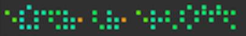

㊙️ bytes_as_braille
===================

**bytes_as_braille** is a pure-python library for displaying bytestrings using Braille cells.
It's 100% pure python.

It was tried to keep dependencies to a strict minimum ; some may be needed for additional functionality.

.. _readchar: https://pypi.org/project/readchar/
.. _truecolor: https://pypi.org/project/truecolor/

Contents
--------

.. toctree::
    :maxdepth: 2

    getting-started
    supported-formats
    changelog

Help
----

If you think you found a bug, or need help with something specific:

- Please check existing issues for similar topics.
- If there's nothing relevant, please open a new issue describing your problem, and
  what you've tried so far.

Issues and source code are all in `GitHub <https://github.com/petaflot/bytes_as_braille>`_.

Donations
---------

Donations are welcome. See `here <https://www.engrenage.ch/i18n/association/donations/>`_ for further
details.

Licence
-------

bytes_as_braille is licensed under the MIT licence. See LICENCE for details.
